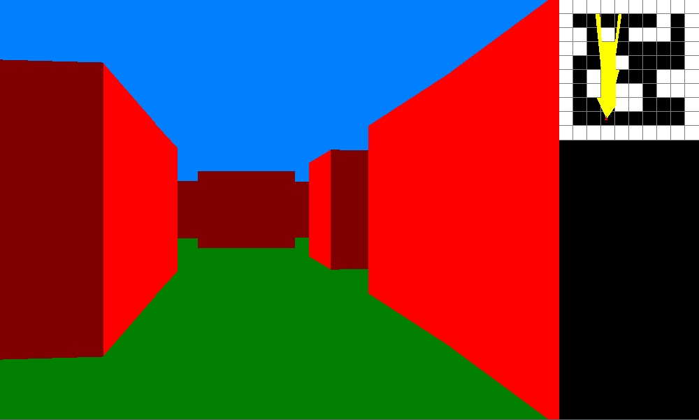

# Cpp-Raycasting-Test

This project is a test of using Raycasting render method to simulate a 3D environment.
## Features
- Possibility to move around in the generated room
## Installation
1. Download the repository by clicking on `Code > Download ZIP`
2. Extract the ZIP file
3. Run `main.exe`
## Usage
After opening `main.exe` you will see a window that looks like this :

You can move around using arrow keys.